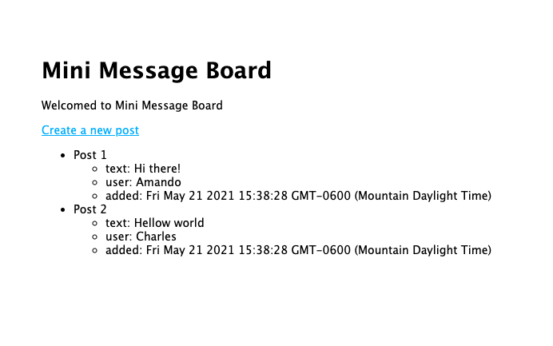

# Mini-Message-Board

A message board that consists of a home page with all posts and page to create new posts.

    

## Features

- Uses Node.js, Express, and Pug.

## Demo / Installation

1.  Clone this repo.
2.  Run the following commands in your terminal, within the folder that was downloaded.

        npm i
        npm start

3.  Go to http://localhost:3000 in your browser
